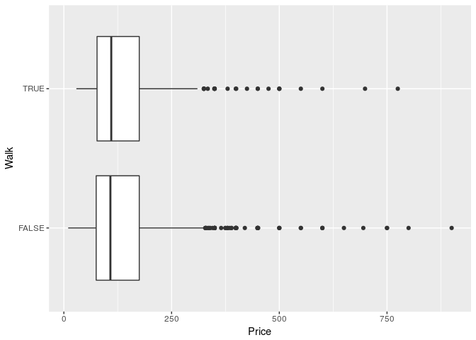
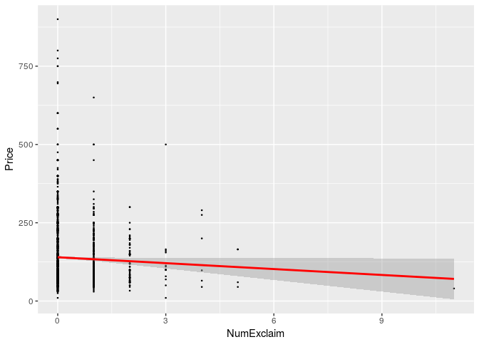
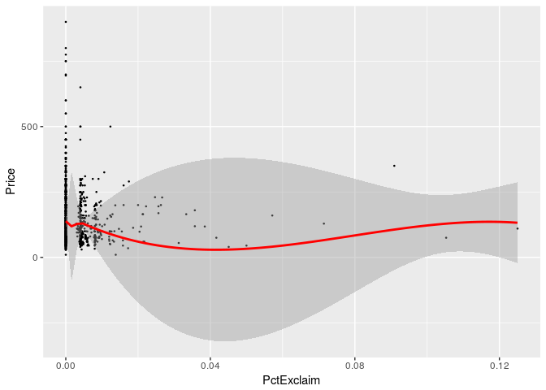

You should submit a knitted pdf file on Moodle, but be sure to show all
of your R code, in addition to your output, plots, and written
responses.

Factors, Functions, and Vectors
-------------------------------

1.  Given the output below, write out the elements of the vector `y`.

<!-- -->

    #> sort(y)
    #[1] -2 -2 -1  0  3  4  4  7
    #
    #> order(y)
    #[1] 1 8 4 5 6 2 7 3

    y <- c(-2, 4, 7, -1, 0, 3, 4, -2)
    sort(y)

    ## [1] -2 -2 -1  0  3  4  4  7

    order(y)

    ## [1] 1 8 4 5 6 2 7 3

1.  Explain what the following function does and demonstrate by running
    `foo1(x)` with a few appropriately chosen vectors `x`.

<!-- -->

    foo1 <- function(x) {
      diff <- x[-1] - x[1:(length(x) - 1)]
      length(which(diff < 0))
    }

foo1 finds the differnce between successive values of `x` and counts how
many of those differences are negative (e.g. drop from the 5th value to
the 6th)

1.  Write a function using `if`, `else if`, and `else` to print out
    "good morning" if it's before 12 PM, "good afternoon" if it's
    between 12 PM and 5 PM, and "good evening" if it's after 5 PM. Your
    function should work if you input a time like:
    `greet(time = "2018-05-03 17:38:01 CDT")` or if you input the
    current time with `Sys.time()`.

<!-- -->

    hours <- parse_number(str_sub(Sys.time(), 12, 13))
    greet <- function(time = Sys.time()) {
      hour <- parse_number(str_sub(time, 12, 13))
      if (hour < 12) {
        print("good morning")
      } else if (hour < 17) {
        print("good afternoon")
      } else {
        print("good evening")
      }
    }
    greet()

    ## [1] "good evening"

    greet(time = "2018-05-03 17:38:01 CDT")

    ## [1] "good evening"

1.  Write a for loop to compute the mean of every column in `mtcars`.

<!-- -->

    output <- vector("double", ncol(mtcars))  # 1. output
    for (i in seq_along(mtcars)) {            # 2. sequence
      output[[i]] <- mean(mtcars[[i]])        # 3. body
    }
    output

    ##  [1]  20.090625   6.187500 230.721875 146.687500   3.596563   3.217250
    ##  [7]  17.848750   0.437500   0.406250   3.687500   2.812500

Airbnb Data
-----------

1.  `airbnbData.csv` contains data scraped on 2022 airbnb units in the
    Boston area (65 variables). The code below shows a function which
    returns a set of summary statistics for a single variable. Note a
    couple of strange elements (e.g. `enquo` and `!!var`) that were
    needed to get around the way tibbles and dplyr handle variable names
    (for way more detail than you probably want on this issue, see
    <https://cran.r-project.org/web/packages/dplyr/vignettes/programming.html>).

<!-- -->

1.  Create a new function called `eda2stats` which produces the same set
    of summary statistics by group. Show your function works by running
    `eda2stats(airbnb.df, Price, S_PropType)`.

2.  Run `eda2stats` again after forming a new Property Type variable
    with only 4 levels: Apartment, House, Bed & Breakfast, and Other.

<!-- -->

    airbnb.df <- read.csv("datasets/airbnbData.csv")
    airbnb.df <- as.tibble(airbnb.df) 

    # First remove 5 units with prices over 1000
    airbnb.df <- airbnb.df %>%
      filter(Price < 1000)

    # Find summary stats on a single variable
    eda1stats <- function(df, var) {
      var <- enquo(var)
      df %>%
        summarise(mean = mean(!!var, na.rm = TRUE),
                  median = median(!!var, na.rm = TRUE),
                  sd = sd(!!var, na.rm = TRUE),
                  iqr = IQR(!!var, na.rm = TRUE),
                  n = n())
    }
    eda1stats(airbnb.df, Price)

    ## # A tibble: 1 x 5
    ##    mean median    sd   iqr     n
    ##   <dbl>  <int> <dbl> <dbl> <int>
    ## 1   138    109  93.0   100  2017

    # Find summary stats by a grouping variable
    eda2stats <- function(df, var, groups) {
      var <- enquo(var)
      groups <- enquo(groups)
      df %>%
        group_by(!!groups) %>%
        summarise(mean = mean(!!var, na.rm = TRUE),
                  median = median(!!var, na.rm = TRUE),
                  sd = sd(!!var, na.rm = TRUE),
                  iqr = IQR(!!var, na.rm = TRUE),
                  n = n())
    }
    eda2stats(airbnb.df, Price, S_PropType)

    ## # A tibble: 9 x 6
    ##   S_PropType       mean median     sd    iqr     n
    ##   <fct>           <dbl>  <dbl>  <dbl>  <dbl> <int>
    ## 1 Apartment       143    120    84.7  105     1446
    ## 2 Bed & Breakfast 110    105    37.9   45.0     41
    ## 3 Cabin            84.7   85.0   4.51   4.50     3
    ## 4 Dorm             60.0   60.0  NA      0        1
    ## 5 House           128     85.0 115     60.0    508
    ## 6 Loft            177    125   116    118       11
    ## 7 Not Found        92.5   92.5  17.7   12.5      2
    ## 8 Other            83.8   97.5  56.2   71.2      4
    ## 9 /s/Boston--MA   115    115    NA      0        1

    # Create fewer levels of the grouping variable
    airbnb.df <- airbnb.df %>%
      mutate(S_PropType2 = fct_lump(S_PropType, n = 3))
    eda2stats(airbnb.df, Price, S_PropType2)

    ## # A tibble: 4 x 6
    ##   S_PropType2      mean median    sd   iqr     n
    ##   <fct>           <dbl>  <dbl> <dbl> <dbl> <int>
    ## 1 Apartment         143  120    84.7 105    1446
    ## 2 Bed & Breakfast   110  105    37.9  45.0    41
    ## 3 House             128   85.0 115    60.0   508
    ## 4 Other             132  102    95.5  47.5    22

1.  Use `stringr` functions to extract at least one feature from
    `AboutListing` and create a plot to determine if that feature is
    related to `Price`. A couple of examples are illustrated below.

<!-- -->

    # Analyze features of AboutListing description
    foo1 <- airbnb.df$AboutListing[5]
    str_length(foo1)

    ## [1] 249

    str_count(foo1, "!")

    ## [1] 2

    str_detect(foo1, "[Ww]alk")

    ## [1] TRUE

    str_length(airbnb.df$AboutListing)[1:50]   # missings seems to have length 7

    ##  [1]   7 250   7   7 249 250 551   7 242 244 193   7   7 238 250   7 143
    ## [18]   7 103 244   7 277 250 250   7 216 246   7 246   7 249 189   7 237
    ## [35] 105  31  45 245   7 148 120 250 260 235 221 235 237 187 222   7

    airbnb.df <- airbnb.df %>%
      mutate(NumExclaim = str_count(AboutListing, "!"),
             PctExclaim = ifelse(str_length(AboutListing) == 7, NA, 
               str_count(AboutListing, "!") / str_length(AboutListing)),
             Walk = str_detect(AboutListing, "[Ww]alk"))
    airbnb.df %>% group_by(Walk) %>% tally()

    ## # A tibble: 2 x 2
    ##   Walk      n
    ##   <lgl> <int>
    ## 1 F      1476
    ## 2 T       541

    airbnb.df %>% group_by(NumExclaim) %>% tally()

    ## # A tibble: 7 x 2
    ##   NumExclaim     n
    ##        <int> <int>
    ## 1          0  1603
    ## 2          1   314
    ## 3          2    76
    ## 4          3    13
    ## 5          4     6
    ## 6          5     4
    ## 7         11     1

    with(airbnb.df, summary(PctExclaim))

    ##    Min. 1st Qu.  Median    Mean 3rd Qu.    Max.    NA's 
    ##  0.0000  0.0000  0.0000  0.0021  0.0040  0.1250     451

    ggplot(airbnb.df, aes(x = Walk, y = Price)) +
      geom_boxplot() + coord_flip()

    ggplot(airbnb.df, aes(x = NumExclaim, y = Price)) +
      geom_point(size = 0.25) + 
      geom_smooth(method = "lm", colour = "red")

    ggplot(airbnb.df, aes(x = PctExclaim, y = Price)) +
      geom_point(size = 0.25) + 
      geom_smooth(method = "loess", colour = "red")

